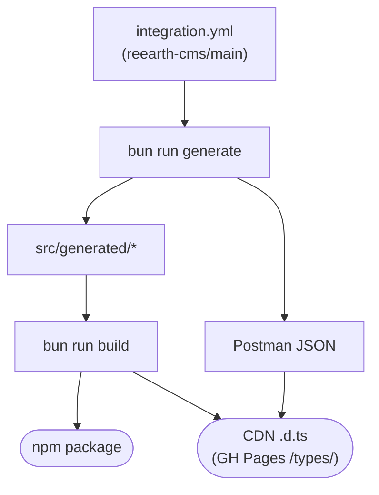

# Introduction

`reearth-cms-integration-api-helper` provides TypeScript types **and**
transport-agnostic fetch utilities for the
[reearth-cms Integration REST API](https://github.com/reearth/reearth-cms/blob/main/server/schemas/integration/integration.yml).
Both are auto-generated from the same OpenAPI spec the backend uses, so the
client and server always describe the same API — no hand-written types, no
drift.

## What you get

- **Fully typed.** Every operation's path params, query, body, and response
  body are typed directly off the spec. Hover any `operationId` in your
  editor for the full shape.
- **Two layers.** `buildRequest()` returns a plain
  `{ method, url, headers, body }` descriptor (no I/O). `createClient()` wraps
  it with a typed method per `operationId` (48 operations today).
- **Transport-agnostic.** Use native `fetch`,
  [axios](https://github.com/axios/axios),
  [ofetch](https://github.com/unjs/ofetch),
  [ky](https://github.com/sindresorhus/ky),
  [tanstack-query](https://github.com/TanStack/query), or anything else. The
  default transport uses global `fetch`; supply your own via a pluggable
  `transport` option.
- **Zero runtime dependencies.** Ships ESM `.js` + `.d.ts`. Works on Node
  20.11+, Bun, Deno, browsers, and edge runtimes.

## How the types are built

Every type and runtime shape in this library descends from a single source of
truth: the OpenAPI spec at `reearth-cms/server/schemas/integration/integration.yml`.
Because the backend is generated from the same YAML, the client and server
stay aligned by construction.

Running `bun run generate` fetches the spec from GitHub (`main` branch),
hashes it with SHA-256, and feeds it into three generators in parallel:
`openapi-typescript` produces `src/generated/schema.ts` (all path, operation,
and component types); a small custom AST walker emits
`src/generated/operations.ts` (the runtime `operationId → { method, path }`
map) and `src/generated/client.ts` (one typed method per `operationId`); and
`openapi-to-postmanv2` writes `docs/public/integration.postman_collection.json`.
The spec hash is baked into `src/generated/version.ts` so `createClient()`
can later do a best-effort drift check against the live spec at runtime.

`bun run build` then turns `src/` into the shipped package. `tsc` emits
`dist/*.js` plus per-module `dist/*.d.ts`, and `scripts/bundle-types.ts`
rolls every `.d.ts` into a single `dist/bundled.d.ts` — the flat file that
CDN consumers point their editor at. The same bundled file is copied into
`docs/public/types/` (latest, version-pinned, plus a `manifest.json`) so it
is served from this VitePress site for URL-import workflows.

## Compatibility

Runtime behaviour is identical across every consumer style below — the
library is plain ESM and runs anywhere `fetch` runs. The matrix is strictly
about **editor type hints**.

| Consumer                                      | Type hints in editor | How types are resolved                                                                                         |
| --------------------------------------------- | -------------------- | -------------------------------------------------------------------------------------------------------------- |
| npm + TypeScript                              | Yes                  | `package.json#types` → `dist/index.d.ts` (automatic)                                                           |
| npm + JavaScript (`// @ts-check`)             | Yes                  | Same `dist/index.d.ts`; opt in per-file with `// @ts-check` or project-wide via `checkJs`                      |
| CDN + external `<script src="./main.js">`     | Yes                  | Requires `jsconfig.json` `paths` mapping to a bundled `.d.ts` — see [CDN + Types](./cdn-types)                 |
| CDN + inline `<script type="module">` in HTML | No                   | VS Code runs a per-`<script>` TS project that ignores `jsconfig.json` `paths`, so URL imports resolve to `any` |

## Next

- [Install →](./install)
- [Basic usage →](./usage)
