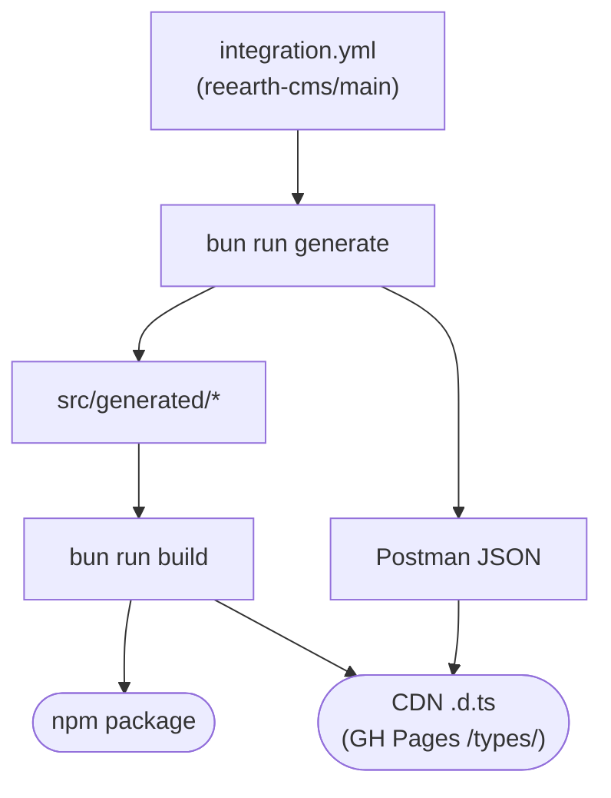

# 概要

`reearth-cms-integration-api-helper` は、[reearth-cms Integration REST API](https://github.com/reearth/reearth-cms/blob/main/server/schemas/integration/integration.yml) のための TypeScript 型定義と、HTTP ライブラリに依存しない fetch ユーティリティを提供します。型もランタイムも、バックエンドが利用しているものと同じ OpenAPI 仕様から自動生成されるため、クライアントとサーバーの API 定義が食い違うことはありません。手書きの型は存在せず、ドリフトも発生しません。

## 主な特徴

- **完全な型付け**: 各オペレーションのパスパラメータ、クエリ、ボディ、レスポンスボディが仕様から直接型付けされています。`operationId` にホバーすれば全体像が確認できます。
- **2 層構造**: `buildRequest()` は `{ method, url, headers, body }` という単なるリクエスト記述子を返し、I/O は行いません。`createClient()` はその上に `operationId` ごとの型付きメソッドを持つクライアントを提供します (現在 48 オペレーション)。
- **HTTP ライブラリ非依存**: ネイティブ `fetch`、[axios](https://github.com/axios/axios)、[ofetch](https://github.com/unjs/ofetch)、[ky](https://github.com/sindresorhus/ky)、[tanstack-query](https://github.com/TanStack/query) など、お好みのライブラリを差し替え可能です。デフォルトはグローバル `fetch` を使用し、`transport` オプションで任意の実装に差し替えられます。
- **ランタイム依存ゼロ**: ESM `.js` + `.d.ts` を同梱します。Node 20.11 以上、Bun、Deno、モダンブラウザ、エッジランタイムで動作します。

## 型が生成される仕組み

このライブラリが提供する型とランタイムは、すべて唯一の情報源である `reearth-cms/server/schemas/integration/integration.yml` から派生しています。バックエンドも同じ YAML から生成されているため、クライアントとサーバーの定義は構造的に一致し続けます。

`bun run generate` を実行すると、GitHub の `main` ブランチから仕様を取得し、SHA-256 でハッシュ化した上で、3 つのジェネレータに並列で渡されます。`openapi-typescript` が `src/generated/schema.ts` を生成し (パス、オペレーション、コンポーネントの型定義)、小さなカスタム AST ウォーカーが `src/generated/operations.ts` (ランタイム用 `operationId → { method, path }` マップ) と `src/generated/client.ts` (`operationId` ごとの型付きメソッドシグネチャ) を書き出し、`openapi-to-postmanv2` が `docs/public/integration.postman_collection.json` を出力します。仕様のハッシュは `src/generated/version.ts` に埋め込まれ、`createClient()` が実行時にベストエフォートでドリフトチェックを行えるようにします。

続いて `bun run build` が `src/` をパッケージとして出荷する形に変換します。`tsc` が `dist/*.js` とモジュールごとの `dist/*.d.ts` を出力し、`scripts/bundle-types.ts` がすべての `.d.ts` を単一の `dist/bundled.d.ts` にまとめます。これが CDN 利用時にエディタから参照するフラットな `.d.ts` です。同じファイルは `docs/public/types/` にも (最新版・バージョン固定版・`manifest.json` とともに) コピーされ、この VitePress サイト経由で配信されるため、URL インポート環境からも利用できます。

## 互換性

ランタイムの挙動はどの利用形態でも同じです — ESM として動作し、`fetch` が使える環境ならどこでも動きます。下の表は **エディタでの型ヒント** のみを対象としています。

| 利用形態                                           | エディタの型ヒント | 型の解決方法                                                                                                                           |
| -------------------------------------------------- | ------------------ | -------------------------------------------------------------------------------------------------------------------------------------- |
| npm + TypeScript                                   | あり               | `package.json#types` → `dist/index.d.ts` (自動)                                                                                        |
| npm + JavaScript (`// @ts-check`)                  | あり               | 同じ `dist/index.d.ts` を使用。`// @ts-check` をファイル先頭に書くか、`checkJs` をプロジェクト全体で有効化                             |
| CDN + 外部 `<script src="./main.js">`              | あり               | `jsconfig.json` の `paths` でバンドル済み `.d.ts` にマッピングする必要あり — [CDN と型](./cdn-types) を参照                            |
| CDN + HTML 内のインライン `<script type="module">` | なし               | VS Code は `<script>` ごとに独立した TS プロジェクトを立てるため、`jsconfig.json` の `paths` が無視され、URL インポートが `any` になる |

## 次のステップ

- [インストール →](./install)
- [基本的な使い方 →](./usage)
